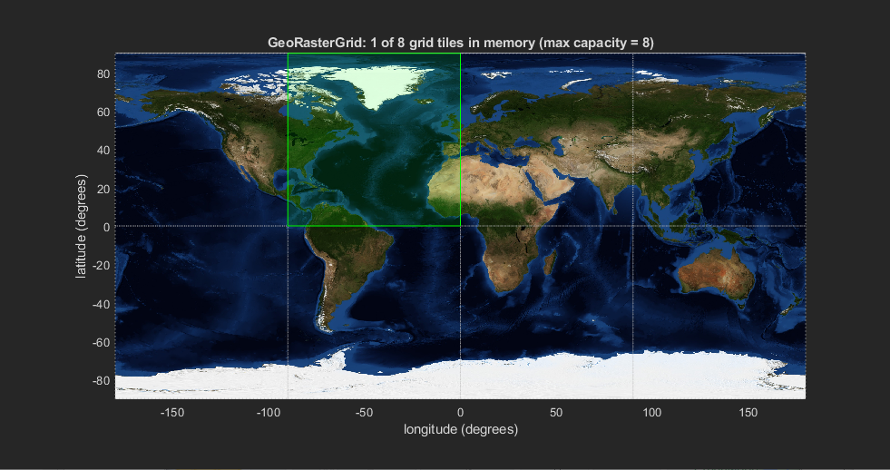

# GeoRasterGrid

Many geospatial datasets are very large and are often broken down into tiles 
so that users may load only the geographic region relevant to their work.

A few data products that implement this are:

* [NASA's Blue Marble DEM](https://visibleearth.nasa.gov/images/73934/topography) (included; see `./data/blue-marble`)
* [GMTED2010](https://topotools.cr.usgs.gov/gmted_viewer/viewer.htm)
* [Global Surface Water](https://global-surface-water.appspot.com/download)
* and many more

This tiled approach is more memory-efficient, but it can be annoying to work with 
for users who only need to look up data by `(lat, lon)`.  This class provides a 
facility to access tiled geospatial data products by `(lat, lon)`, and internally 
it handles tile lookup, loading, caching, and interpolation.

## Quickstart

The easiest way to start is with the Blue Marble dataset included in the `./data` folder.
If no arguments are provided to `GeoRasterGrid`, it will look for the blue-marble dataset 
in that folder:

```
blue_marble = fileparts(which('gebco_08_rev_elev_A1_grey_geo.tif'))
assert(~isempty(blue_marble), 'Expected ./data/blue-marble to be on the MATLAB path');

% load the map by providing the folder containing the GeoTIFF files
map = GeoRasterGrid(blue_marble)

% with no input args, it defaults to the included dataset (same as previous command)
map = GeoRasterGrid()
```

With the map object created, you can call `map.show` to see the tile boundaries 
overlaid on an (included) RGB map of the Earth:

<p align="center">
  
</p>

Then, let's say we wanted to access a data point in Florida--at `(28.540822, -81.374806)`. 
We just need to use the `get()` method:

```
value = map.get(28.540822, -81.374806)
```

`value` is the *interpolated* value of the DEM at the requested `(lat, lon)`.  At the moment
the interpolation scheme is `cubic` and it is controlled by the `GeoRasterTile.interp` property, 
which would have to be changed manually by the user.

If the `map.show()` figure is still open, you'll notice that it has been updated:

<p align="left">
  
</p>

Here, the tile that was loaded is colored green to indicate that it is currently-loaded in memory. 
This figure can be opened or closed at any time and will always update to reflect the current 
state of the map.

## Initializing Maps

<WIP>
